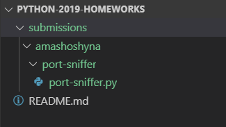

[![MIT Licensed][icon-mit]][license]
[![Kottans-Backend][icon-kottans-be]][kottans-backend]
[![Telegram][icon-chat]][chat]

#  Python 2019 course homeworks
This repo was created for students to submit their homeworks for review. 

### How to submit
- fork this repository
- clone your fork to your local machine: `git clone https://github.com/YOUR_USERNAME/python-2019-homeworks.git`
- add this repository as an upstream: `git remote add upstream https://github.com/kottans/python-2019-homeworks.git`
- for every new task you're gonna submit, in your local repository:
  - `git checkout master` and then create new branch, name it according to task performed (aka feature branch): `git checkout -b port-sniffer`. In this example feature branch is named `port-sniffer`
  - add a folder with your github name under  `submissions` (if you haven't yet)
   - under your name folder, add a folder with task name and put your code in the folder

  See example file structure you are expected to have below:

  
- make pull-request to this repository following these steps:
  - checkout the relevant feature branch: `git checkout port-sniffer` (in this example feature branch is called `port-sniffer`)
  - commit your changes if any to the feature branch
  - checkout `master` branch: `git checkout master`
  - pull latest changes from upstream `master` branch: `git pull upstream master`
  - rebase your feature branch onto `master`: `git checkout port-sniffer && git rebase master`
  - resolve any merge conflicts if there are any
  - push feature branch to your remote repository: `git push --set-upstream origin port-sniffer`
  - make pull-request from your repository to this repository via GitHub web-interface
- post a link to your subtask PR in the
     [BE Questionarium chat](https://t.me/joinchat/DqrdixM_mjurcmQkkQ11Og)
     and ask mentors for a code review
     * wait for review from course mentors
     * if necessary, make changes, until your code will be approved and merged
     * once the code review phase successfully finished
     and you have an approval from one of the mentors
     add to your `kottans-backend/README.md`
     a link to subtask code base and
     a note saying `Reviewed and approved by @<mentor>`
     (use mentor's github username)
   * list your reflections on this subtask
     (_what was new to you_, _what surprised you_, _what you intend to use in future_)
- when any changes are required (whether it si your own decision or requested by a mentor)
  * checkout your feature branch before any code base updates: `git checkout <feature-branch-name>`
  * once committed the changes and ready to update your pull request just `git push origin`;
    GitHub will track your new commits and update the pull request
     
[icon-mit]: https://img.shields.io/badge/license-MIT-blue.svg
[license]: https://github.com/OleksiyRudenko/a-tiny-JS-world/blob/master/LICENSE.md
[icon-chat]: https://img.shields.io/badge/chat-on%20telegram-blue.svg

[icon-kottans-be]: https://img.shields.io/badge/%3D(%5E.%5E)%3D-backend-yellow.svg
[kottans-backend]: https://github.com/kottans/backend
[chat]: https://t.me/joinchat/Dqrdixe1c2K9bXUFBzNWtg
